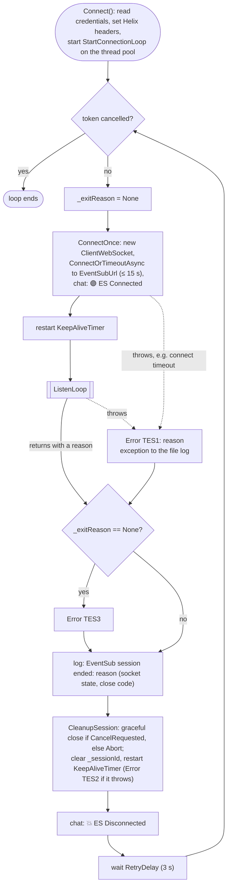
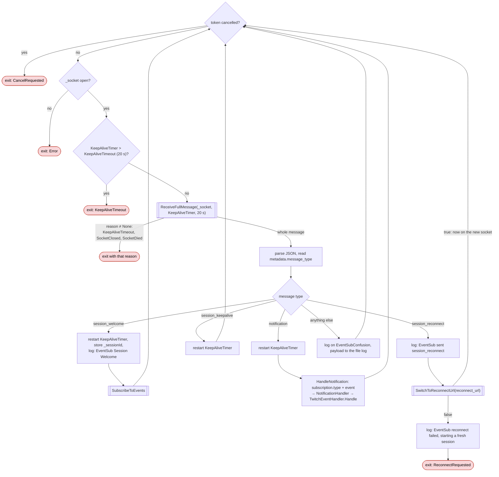
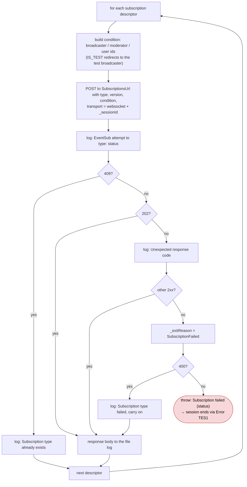
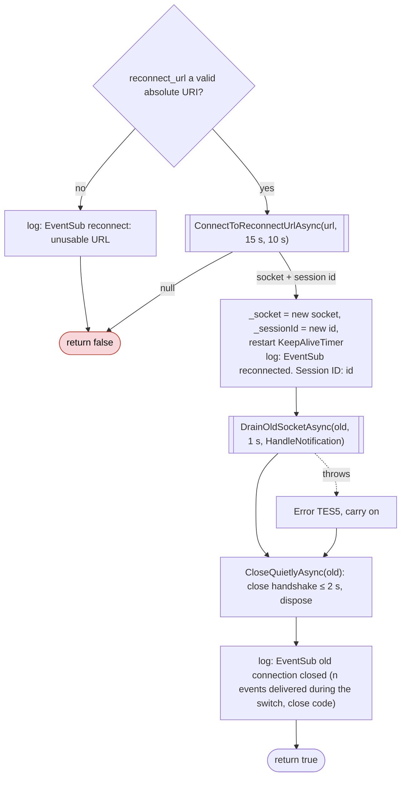
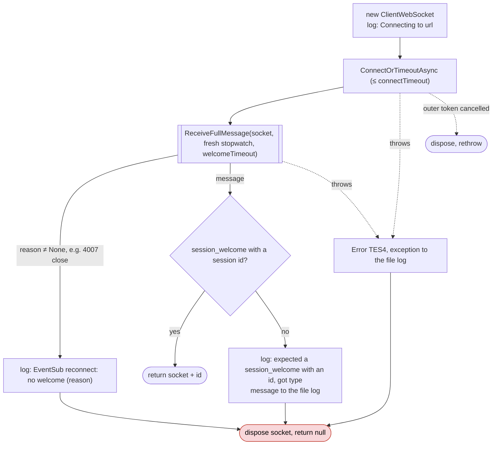
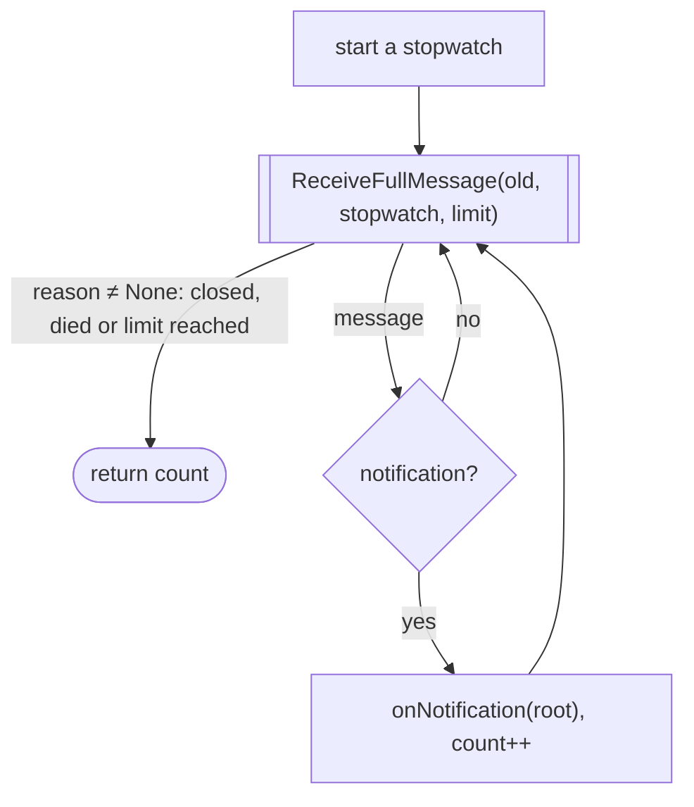
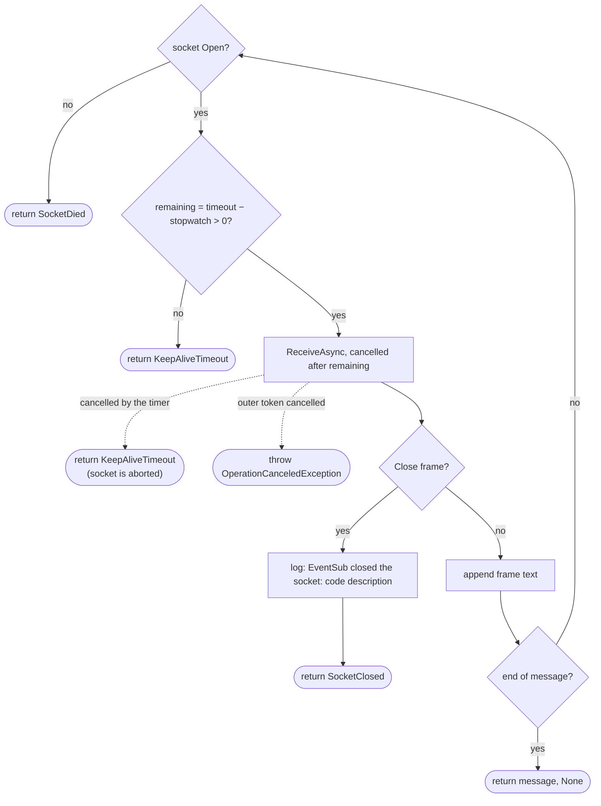

# EventSub flow charts

How [TwitchEventSub.cs](../code/Twitch/TwitchEventSub.cs) runs, method by method. The prose, the exit-reason
table and the log lines are in [twitch.md § EventSub](twitch.md#eventsub); these charts are the map.

The charts are [Mermaid](https://mermaid.js.org/). GitHub renders them; in VS Code the built-in Markdown preview
needs a Mermaid extension (for example *Markdown Preview Mermaid Support*).

Shapes: rounded boxes are steps, diamonds are decisions, `[[ ]]` boxes are calls into another chart, and red
boxes are where a session ends.

## Connection loop — `StartConnectionLoop`

Started once by `Connect()` on the thread pool; runs until `Disconnect()` cancels the token. Each pass is one
session on the default URL.

## Message loop — `ListenLoop`

Reads one message at a time from `_socket` and acts on it. It returns only to end the session, after setting
`_exitReason`; a successful planned reconnect stays inside it.

## Subscribing — `SubscribeToEvents` / `Subscribe`

Runs after every `session_welcome` on a **fresh** session, never after a planned reconnect (subscriptions
carry over). One POST per entry in `TwitchEventSubSubscription.Subscriptions`, in order.

A 400 sets `_exitReason` but doesn't end the session; the reason only shows if the session later ends through
an exception.

## Planned reconnect — `SwitchToReconnectUrl`

Twitch's flow: open the new socket while the old one stays open, take the welcome, switch, then retire the old
one.

### `ConnectToReconnectUrlAsync`

### `DrainOldSocketAsync`

## Reading a message — `ReceiveFullMessage`

Shared by the message loop, the reconnect welcome and the drain. Reassembles 8 KiB frames into one message and
enforces the timeout against the stopwatch it's given, so the limit counts from the last message, not from this
call.

## Test seams

`EventSubLoopTests` runs `StartConnectionLoop` itself against a loopback fake of Twitch, through four
`internal static` overrides: `EventSubUrl`, `SubscriptionsUrl`, `RetryDelay`, and `NotificationHandler` (so
events reach a capture instead of the real alert handlers). The bot never changes them.
